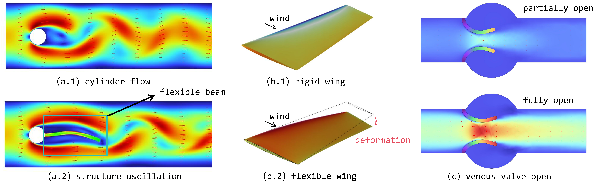
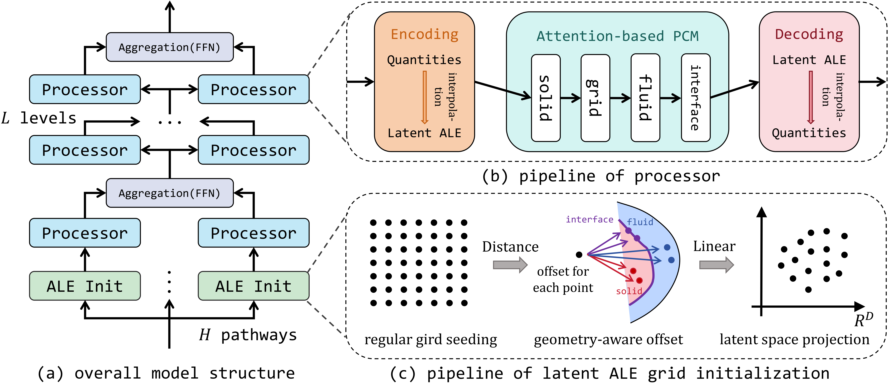
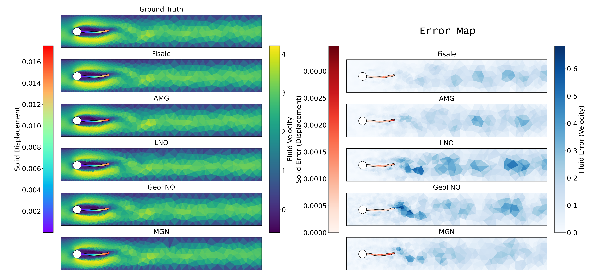
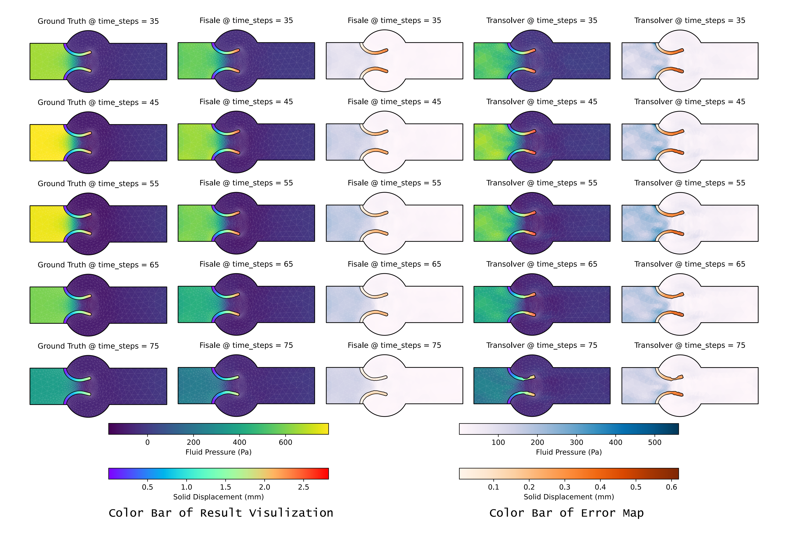
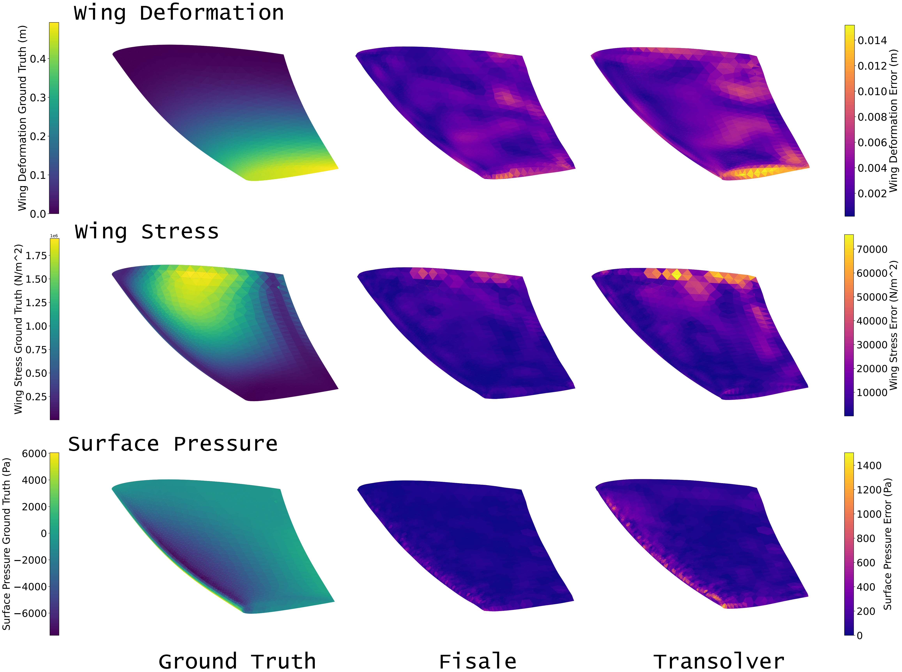

# Fisale
Code for "[Neural Latent Arbitrary Lagrangian-Eulerian Grids for Fluid-Solid Interaction](https://arxiv.org/abs/2603.00792)", accepted at International Conference on Learning Representations (ICLR 2026).





## Usage

### Install dependencies

1. recommend `python 3.10`, `torch 2.5.0`.
2. install `torch_geometric` follow the [official repo](https://github.com/pyg-team/pytorch_geometric).
3. other dependencies: `h5py`, `einops`, `toml`.

### Create Data and Assets Filefolders

Filefolders should follow the structure:

```
root_folder/
├── structure_oscillation/
│   ├── assets/
|   |   ├──checkpoints             # save model weight
|   |   ├──logs                    # save training and test logs
|   |   └──normalizers             # save normalizers
│   └── data/          
|       ├──input                   # dataset
|       └──ret                     # prediction results
├── venous_valve/
│   ├── assets/
|   |   ├──checkpoints   
|   |   ├──logs          
|   |   └──normalizers   
│   └── data/
|       ├──input         
|       └──ret           
└── flexible_wing/
    ├── assets/
    |   ├──checkpoints   
    |   ├──logs          
    |   └──normalizers  
    └── data/
        ├──input        
        └──ret           
```

### Dataset

The dataset should put in respective `input` folder.

The structure oscillation dataset can be found in [CoDA-NO repo](https://github.com/neuraloperator/CoDA-NO).

You can download our venous valve and flexible wing datasets from this [link](https://disk.pku.edu.cn/link/AA579CFCCB9AFF4614B7B0FC0525F5554E).


### Train, eval and test the model

```
# run structure oscillation task
setsid python -u exp_structure_oscillation.py & 

# run venous valve task
setsid python -u exp_venous_valve.py &

# run flexible wing task
setsid python -u exp_flexible_wing.py &
```

- You can use the default config in `config.toml` to reproduce the experiment results. You can also explore more by modifying the configs.

## Visualization

### Structure Oscillation




### Venous Valve



### Flexible Wing




## Contact

Any further questions, please contact shilongtao@stu.pku.edu.cn.

## Citation

If you find this repo useful for you, please consider citing the following paper:

```
@inproceedings{tao2026neural,
  title={Neural Latent Arbitrary Lagrangian-Eulerian Grids for Fluid-Solid Interaction},
  author={Tao, Shilong and Feng, Zhe and Chen, Shaohan and Zhang, Weichen and Zhu, Zhanxing and Liu, Yunhuai},
  booktitle={International Conference on Learning Representations},
  year={2026}
}

@inproceedings{tao2025unisoma,
  title={Unisoma: A Unified Transformer-based Solver for Multi-Solid Systems},
  author={Tao, Shilong and Feng, Zhe and Sun, Haonan and Zhu, Zhanxing and Liu, Yunhuai},
  booktitle={International Conference on Machine Learning},
  year={2025}
}

@inproceedings{tao2025ladeep,
  title={LaDEEP: A Deep Learning-based Surrogate Model for Large Deformation of Elastic-Plastic Solids},
  author={Tao, Shilong and Feng, Zhe and Sun, Haonan and Zhu, Zhanxing and Liu, Yunhuai},
  booktitle={ACM SIGKDD Conference on Knowledge Discovery and Data Mining},
  year={2025}
}

```

## Acknowledgement

We sincerely appreciate the following repos for their code and dataset: 

- [Neural-Solver-Library](https://github.com/thuml/Neural-Solver-Library)

- [Neuraloperator](https://github.com/neuraloperator/neuraloperator)

- [CoDA-NO](https://github.com/neuraloperator/CoDA-NO)

- [Geo-FNO](https://github.com/neuraloperator/Geo-FNO)

- [Transolver](https://github.com/thuml/Transolver/tree/main)